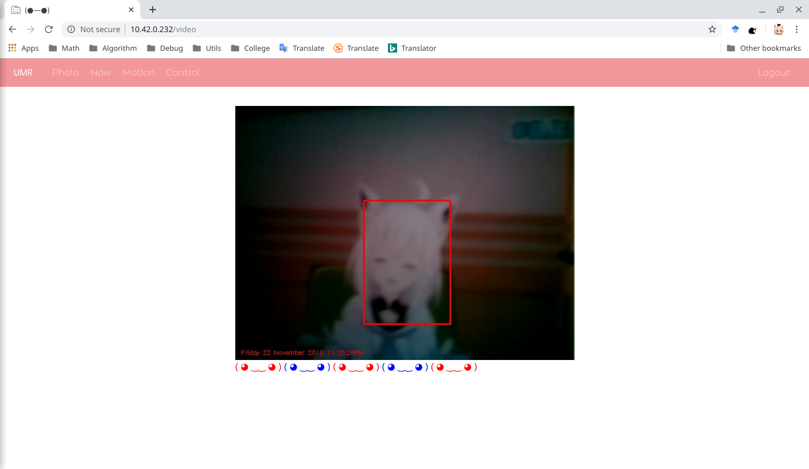
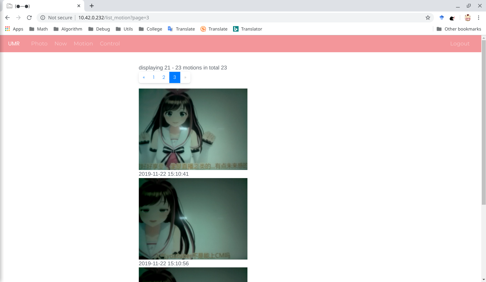
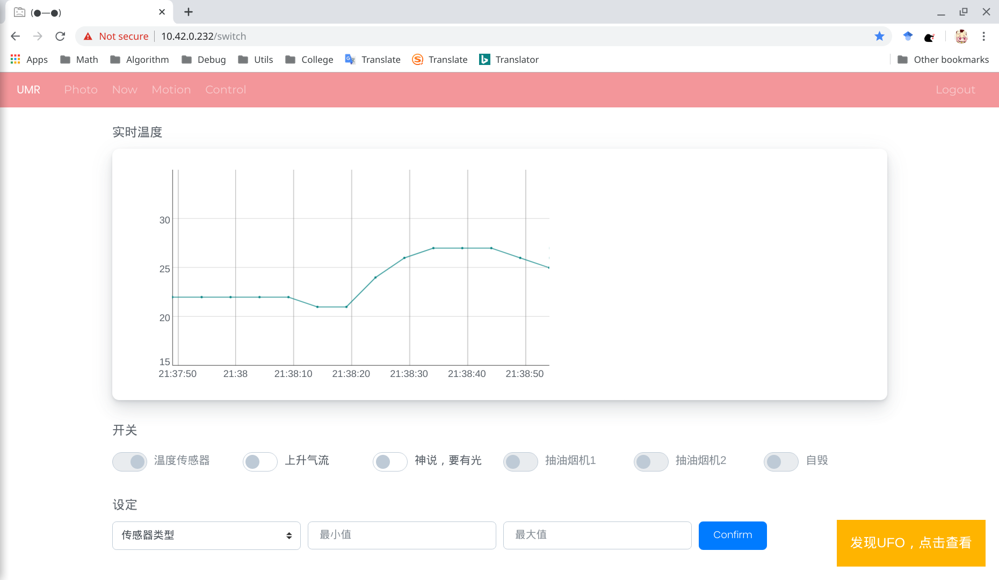

# Taste Guide

UMR-Dive 是一个简单，自由，超低成本的智能家居系统，可在任何网络覆盖的位置实时遥控家中的智能设备，获取家中的环境数据，在线查看家中的视频，也能对非法入侵做出提醒。设计上基于雾计算架构，在硬件和软件两个层面展开，拥有不知所云的自主知识产权，达到了国际落后水平，实现了信息的自主可控。

实验产物，可供创客尝鲜，也可作为毕设参考。

## To Do

- [x] 实时采集室内温度数据，并能根据客户端设置自动开关电风扇；
- [x] 通过传感器节点实现对电视，电脑等家用电器的控制；
- [x] 可根据需要控制任意的照明设备；
- [x] 客户端能监控实时视频信息，提供运动检测和提醒功能；
- [x] 用户权限管理；
- [x] 实现全平台 Web 交互界面；
- [ ] 媒体中心。

## 图片展示

- 实时监控



- 运动记录



- 控制中心



## 食用方法

完整的体验至少需要准备如下硬件，在桃饱网能买到部分模块，剩下的可用面包板或者自己腐蚀电路板（提供 PCB 参考）。不完整的体验只需要一台有摄像头的电脑。
 
- Raspberry Pi 4B ×1
- PI Camera ×1
- 8051 MCU ×1
- 1-Wire temp sensor DS18B20 ×1
- ZigBee CC2530 SoC ×3

Raspberry Pi 的 OS 和相关软件如下所示。

- Raspbian Buster(arm64)
- Python 3.8.2
- OpenCV 4.2
- MariaDB 10.4
- Nginx

推荐的开发工具。

- 全宇宙第二的 PyCharm
- VS Code
- Keil C51

为了避免消化不良，你还需要掌握如下技巧。

- 对硬件一知半解；
- 擅长使用搜索引擎；
- 擅长通过推倒墙娘解锁新姿势。

### 运行环境

网关的本体是一个 Raspberry Pi 4B，运行 Raspbian Buster，应用基于 Python 开发，使用了大量第三方 Library。根目录下的 requirements.txt 文件记录了所有依赖包，需要使用 virtualenv 和 virtualenvwrapper 工具创建一个新的 Python 3 虚拟环境，执行 pip 命令安装所有依赖包。

```bash
$ pip install -r requirements.txt
```

运动捕捉相关功能使用 OpenCV 实现，而 PyPi 预编译的 OpenCV 4 可能缺少部分功能，建议使用源代码编译安装。将 opencv 源代码和扩展库 opencv_contrib 的源代码 Clone 到本地，进入 Python 3 虚拟环境，安装 numpy 和编译工具，使用 CMake 来构建编译配置。

```bash
$ cmake -D CMAKE_BUILD_TYPE=RELEASE \
    -D CMAKE_INSTALL_PREFIX=/usr/local \
    -D OPENCV_EXTRA_MODULES_PATH=~/opencv_contrib/modules \
    -D ENABLE_NEON=ON \
    -D ENABLE_VFPV3=ON \
    -D BUILD_TESTS=OFF \
    -D OPENCV_ENABLE_NONFREE=ON \
    -D INSTALL_PYTHON_EXAMPLES=OFF \
    -D BUILD_EXAMPLES=OFF ..
```

确认配置无误后，输入 `make -j4` 开始编译，-j4 参数指定 4 个核心用于编译。在 2G 内存的 Raspberry Pi 4B 上，编译大约需要 1 小时，结束后使用 make install 完成 OpenCV 4 的安装。OpenCV 安装在系统的 site-packages 目录中，还需要创建一个符号链接到 Python 3 虚拟环境来使用 OpenCV。

### 数据库

安装好 MariaDB，通过 flask-migrate 恢复数据结构。

```bash
$ python manage.py db init
$ python manage.py db migrate
$ python manage.py db upgrade
```

### 开动了

根目录下的 gate.py 是网关软件的入口文件，使用如下命令启动程序测试外网访问。在生产环境部署时，还需使用 Nginx 反向代理，以提高系统的稳定性和安全性。

```bash
$ which python
/home/xxx/umr-dive/venv/bin/python
$ export Env=Dev
$ sudo -E /home/xxx/umr-dive/venv/bin/python gate.py -i 0.0.0.0 -o 80
```

Enjoy yourself!

### Tips

- 如果你家没有公网IP，还需用有公网IP的云服务器搭建内网穿透服务。
- 上述操作启动的是测试服务器，生产环境还需使用Nginx反向代理。
- 客户端需支持现代浏览器，比如最新版 Chrome，Firefox，Safari 等。
- 传感器节点采用模块化设计，可更换任意使用标准接口的传感器。

## Reference

暂时想到了这些，排名不分先后。

- [Flask](https://github.com/pallets/flask)
- [Jinja](https://github.com/pallets/jinja)
- [Werkzeug](https://github.com/pallets/werkzeug)
- [Flask-sqlalchemy](https://github.com/pallets/flask-sqlalchemy)
- [Flask-Migrate](https://github.com/miguelgrinberg/flask-migrate/)
- [OpenCV](https://github.com/opencv/opencv)
- [opencv_contrib](https://github.com/opencv/opencv_contrib)
- [PyImageSearch](https://www.pyimagesearch.com/)
- [Bootstrap](https://github.com/twbs/bootstrap)
- [jQuery](https://github.com/jquery/jquery)
- [Dygraphs](https://github.com/danvk/dygraphs)